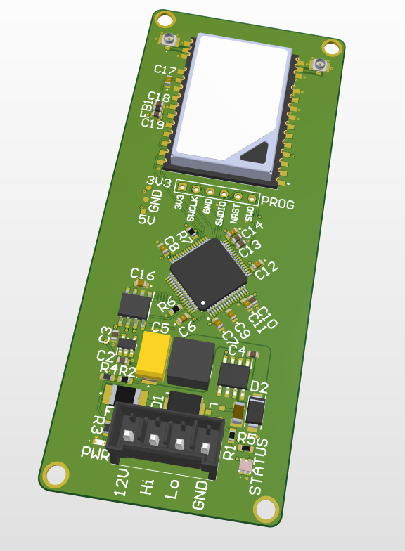

# LiTel

**Li**ve **Tel**emetry — a CAN-to-RF telemetry relay board for Panther Racing (University of Pittsburgh Formula SAE Electric).

LiTel sits on the vehicle CAN bus, ingests broadcast frames from the MoTeC M150 and other nodes, and streams them over a 900 MHz link to a pit-side ground station for live monitoring. It is a **relay, not a logger** as the M150's internal datalog remains the authoritative record for post-session analysis. This keeps the board simple, lightweight, deterministic, and cheap to bring up.

---

## System Design Goals

**Lightweight** - PR-039 should add useful telemetry and testing capabilities while minimizing the weight added to the vehicle. The complete telemetry system, including electronics, wiring, antennas, enclosures, and mounting hardware, shall weigh less than 3 lbs.

**Low-Latency** - The system shall provide end-to-end telemetry latency of less than 200 ms from measurement acquisition to visualization under normal operating conditions. At least 95% of telemetry data shall meet this latency requirement. This represents a 5× improvement over PR-036's approximately 1 s latency.

**Concurrent Data Access** - The telemetry system shall support multiple simultaneous clients viewing vehicle data without causing noticeable degradation in telemetry collection, latency, or data integrity. The system shall support at least 10 simultaneous dashboard instances while maintaining the specified latency and data-rate requirements.

**Reliability** - LiTel shall operate without dependence on external infrastructure such as cellular or internet connectivity. The telemetry link shall tolerate temporary RF interference or packet loss without affecting vehicle operation or requiring manual intervention. Loss of the telemetry link shall not interfere with CAN communication or other vehicle systems.

## Hardware Overview

<!-- 3D render: isometric top view of the assembled board -->
<p align="center">
  
</p>
<p align="center"><em>Fig. 1 — Assembled board in Altium.</em></p>


### Key specifications
| | |
|---|---|
| MCU | STM32H533 (Cortex-M33, 250 MHz) |
| Stackup | 4-layer, mixed-signal (SIG / GND / PWR / SIG) |
| Input voltage | Vehicle LV bus |
| Regulation | TPS54360-Q1 wide-Vin buck |
| CAN | TCAN3404 transceiver — classic CAN, 1 Mbit/s |
| Radio | RFD900ux (SMT module), 900 MHz ISM |
| Debug | SWD |

---

## Architecture

```
  ┌──────────────┐   CAN 1 Mbit/s   ┌──────────────────────────┐   UART   ┌────────────┐
  │  MoTeC M150  │ ───────────────► │          LiTel           │ ───────► │  RFD900ux  │ ))) 900 MHz
  │  + LV nodes  │                  │  FDCAN RX → ring buffer  │          └────────────┘
  └──────────────┘                  │  → COBS framer → UART    │
                                    └──────────────────────────┘
                                                                     ┌──────────────────────────┐
                                                          ((( 900 MHz │  RFD900x + FTDI → Pi 4   │
                                                                     │  Wi-Fi AP → dashboard    │
                                                                     └──────────────────────────┘
```

Data flows one direction only. There is no command path from the pit to the car, and no persistent storage on the board.

---

## Firmware

### CAN ingest
FDCAN operates in interrupt-driven RX mode. The ISR **drains the entire RX FIFO** on each interrupt rather than servicing a single frame, which prevents overrun when several nodes transmit back-to-back. Frames are classic CAN only with a fixed 8-byte DLC, so every record in the pipeline is a uniform size — no variable-length handling anywhere downstream.

### Ring buffer
A fixed-size, lock-free **single-producer/single-consumer** ring buffer decouples the CAN ISR (producer) from the main-loop transmit path (consumer).

Overflow policy is **drop-oldest**: when the buffer is full, the newest frame overwrites the stalest one. For a live-view telemetry link, recent data is strictly more valuable than complete data, and the M150 log covers the gaps.

### Timestamping
The VCU periodically broadcasts synchronization messages over CAN. The ground station uses these messages to establish a common vehicle timebase, allowing telemetry received during a session to be aligned and displayed against a consistent timestamp.

### Wire format
Outbound records are **COBS-framed** before hitting the UART.COBS provides unambiguous packet framing and allows the receiver to recover packet boundaries after dropped or corrupted bytes. A packet CRC provides corruption detection before decoded frames are accepted.

---

## Repository Layout

```
panther-racing-litel/
├── Application/
│   ├── Src/       can_ingest.c, ring_buffer.c, cobs.c, main.c
│   └── Inc/
├── Core           Generated STM32CubeMX project
│   ├── Src/       
│   ├── Inc/
│   └── Drivers/
├── docs/
│   └── images/        3D renders, block diagrams, photos
└── tools/             Host-side decode / test scripts
```

---


## Bring-Up Checklist

- [ ] Power rails verified unloaded (buck output, MCU rails)
- [ ] SWD connectivity and MCU ID confirmed
- [ ] CAN loopback / bus-off behavior verified
- [ ] Ring buffer overflow counter exercised under synthetic load
- [ ] COBS framing validated against host-side decoder
- [ ] RF link budget checked at representative track distance
- [ ] End-to-end: M150 frame → dashboard, with timestamp sanity check

---

## Design Notes

**Why no SD logging?** An earlier revision carried SDMMC + FatFs, a hold-up capacitor bank, and an ideal-diode ORing controller to survive power loss mid-write. All of it existed to protect a log that duplicated what the M150 already stores reliably. Removing logging eliminated the brownout state machine, the hold-up bank, the ORing controller, and the USB mass-storage interface — a large reduction in both board area and firmware, with no loss of capability the team actually depended on.

**Why drop-oldest?** See [Ring buffer](#ring-buffer). Freshness beats completeness for live monitoring.

---


## Acknowledgments

Built for **Panther Racing**, University of Pittsburgh Formula SAE Electric.
