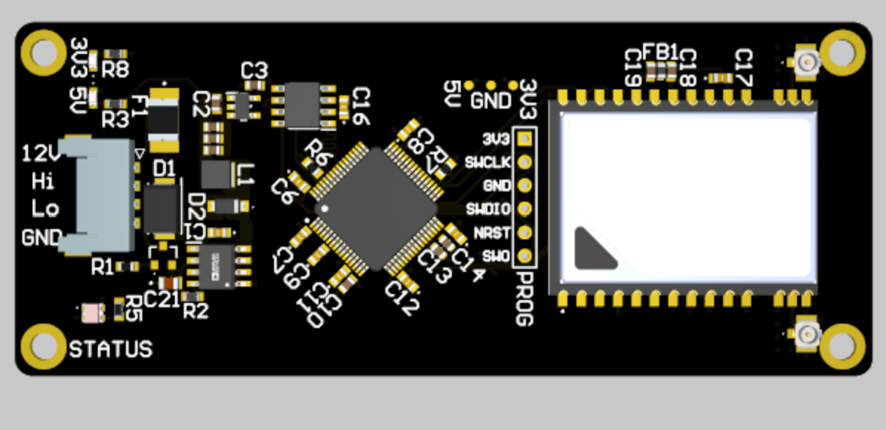

# LiTel

**Li**ve **Tel**emetry — a CAN-to-RF telemetry relay board for Panther Racing (University of Pittsburgh Formula SAE Electric).

LiTel sits on the vehicle CAN bus, ingests broadcast frames from the MoTeC M150 and other nodes, and streams them over a 900 MHz link to a pit-side ground station for live monitoring. It is a **relay, not a logger** — the M150's internal datalog remains the authoritative record for post-session analysis. This keeps the board simple, lightweight, deterministic, and cheap to bring up.

---

## Status & Scope

**Status:** pre-bring-up. Board design is complete; firmware for CAN ingest, the ring buffer, and COBS framing is written but the end-to-end link has not been validated on hardware yet. See [Bring-Up Checklist](#bring-up-checklist).

**What's here:** a design writeup for the LiTel vehicle-side board — architecture, firmware behavior, and the reasoning behind the tradeoffs.

**What's not here:** the source. Firmware, Altium project, and fab outputs live in Panther Racing's internal repos and are not published. Neither is the ground station (Raspberry Pi ingest service, database schema, Wi-Fi AP config, dashboard), which is a separate system on the far side of the RF link.

If a subsystem you expected to find described here is absent, it is probably either deliberate or deferred. [Scope & Known Gaps](#scope--known-gaps) says which.

---

## System Design Goals

**Lightweight** — LiTel should add useful telemetry and testing capability while minimizing weight added to the vehicle. The complete telemetry system, including electronics, wiring, antennas, enclosures, and mounting hardware, shall weigh less than 3 lbs.

**Low-latency** — End-to-end telemetry latency shall be under 200 ms from measurement acquisition to visualization under normal operating conditions, met by at least 95% of telemetry data. This is a 5× improvement over PR-036's roughly 1 s latency.

**Concurrent data access** — The system shall support multiple simultaneous clients viewing vehicle data without noticeable degradation in collection, latency, or data integrity: at least 10 dashboard instances while still meeting the latency and data-rate requirements.

**Reliability** — LiTel shall operate without dependence on external infrastructure such as cellular or internet connectivity. The link shall tolerate temporary RF interference or packet loss without affecting vehicle operation or requiring manual intervention. Loss of the telemetry link shall not interfere with CAN communication or other vehicle systems.

---

## Hardware Overview

<!-- 3D render: isometric top view of the assembled board -->
<p align="center">
  
</p>
<p align="center"><em>Fig. 1 — Assembled board in Altium.</em></p>

### Key specifications
| | |
|---|---|
| MCU | STM32H533 (Cortex-M33, 250 MHz max core) |
| Stackup | 4-layer, mixed-signal (SIG / GND / PWR / SIG) |
| Input voltage | Vehicle LV bus |
| Regulation | ADP2303 buck |
| CAN | TCAN3404 transceiver — classic CAN, 1 Mbit/s |
| Radio | RFD900ux (SMT module), 900 MHz ISM |
| Debug | SWD |

---

## Architecture

The vehicle side is a single path with no branches: CAN frames arrive by interrupt, land in a ring buffer, get COBS-framed, and go out the UART to the radio. Off the board, an RFD900x on a Raspberry Pi 4 receives the stream, decodes it, and serves a dashboard over a local Wi-Fi access point.

```
  ┌──────────────┐   CAN 1 Mbit/s   ┌──────────────────────────┐   UART   ┌────────────┐
  │  MoTeC M150  │ ───────────────► │          LiTel           │ ───────► │  RFD900ux  │ ))) 900 MHz
  │  + LV nodes  │                  │  FDCAN RX → ring buffer  │          └────────────┘
  └──────────────┘                  │  → COBS framer → UART    │
                                    └──────────────────────────┘
                                                                     ┌──────────────────────────┐
                                                         ((( 900 MHz │  RFD900x + FTDI → Pi 4   │
                                                                     │  Wi-Fi AP → dashboard    │
                                                                     └──────────────────────────┘
```


Uplink telemetry is continuous. A low-rate, explicitly whitelisted command path may relay approved frames from the pit to the vehicle CAN bus; it must never be enabled with an empty or broad allowlist. There is no persistent storage on the board.


---

## Firmware Design

### CAN ingest
FDCAN operates in interrupt-driven RX mode. The ISR **drains the entire RX FIFO** on each interrupt rather than servicing a single frame, which prevents overrun when several nodes transmit back-to-back. Frames are classic CAN only with a fixed 8-byte DLC, so every record in the pipeline is a uniform size — no variable-length handling anywhere downstream.

### Ring buffer
A fixed-size, lock-free **single-producer / single-consumer** ring buffer decouples the CAN ISR (producer) from the main-loop transmit path (consumer).

Overflow policy is **drop-oldest**: when the buffer is full, the newest frame overwrites the stalest one. For a live-view link, recent data is strictly more valuable than complete data, and the M150 log covers the gaps.

### Timestamping
The VCU periodically broadcasts synchronization messages over CAN. The ground station uses these to establish a common vehicle timebase, allowing telemetry received during a session to be aligned and displayed against a consistent timestamp.

### Wire format
Outbound records are **COBS-framed** before hitting the UART. COBS provides unambiguous packet framing and lets the receiver recover packet boundaries after dropped bytes. The current protocol relies on the RFD link CRC.

---

## Bring-Up Checklist

- [ ] Power rails verified unloaded (buck output, MCU rails)
- [ ] SWD connectivity and MCU ID confirmed
- [ ] FDCAN kernel clock and bit timing verified at 1 Mbit/s
- [ ] CAN loopback / bus-off recovery behavior verified
- [ ] Ring buffer overflow counter exercised under synthetic load
- [ ] COBS framing validated against host-side decoder
- [ ] RF link budget checked at representative track distance
- [ ] End-to-end: M150 frame → dashboard, with timestamp sanity check

---

## Scope & Known Gaps

Things that are absent on purpose:

- **No SD logging.** An earlier revision carried SDMMC + FatFs, a hold-up capacitor bank, and an ideal-diode ORing controller to survive power loss mid-write. All of it existed to protect a log that duplicated what the M150 already stores reliably. Removing logging also removed the brownout state machine, the hold-up bank, the ORing controller, and the USB mass-storage interface — a large reduction in board area and firmware, with no loss of capability the team depended on.
- **No hold-up / brownout circuitry.** Nothing on the board needs to survive a power cut gracefully; a dropped frame during a brownout is indistinguishable from a dropped frame over RF, and both are already tolerated.
- **No persistent storage of any kind.** The board holds at most one ring buffer's worth of frames.

Things that are absent but won't stay that way:

- **No application-layer CRC.** Framing integrity currently rests on the RFD link CRC alone. An application CRC needs to land together with a timestamp freshness check, since without freshness a replayed valid-CRC frame is accepted as current.
- **Command path is unimplemented.** The downlink is described above but not built. When it is, it starts closed: an explicit per-ID allowlist, rejected by default, and no build configuration that ships with an empty or wildcard list.
- **Bring-up is unfinished.** Treat every specification above as designed-to, not measured, until the checklist is checked off — latency, range, and weight numbers especially.

---

## Acknowledgments

Built for **Panther Racing**, University of Pittsburgh Formula SAE Electric.
